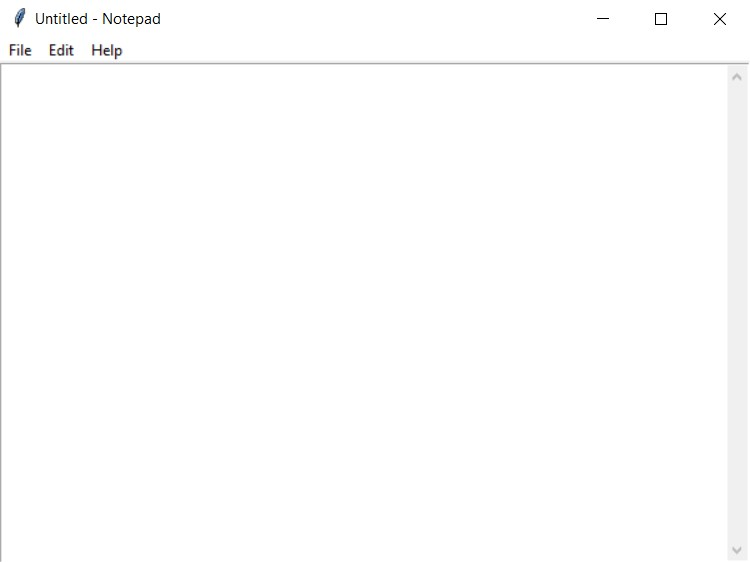

# python notepad

#
    def __showAbout(self):
        showinfo("Notepad")

    def __openFile(self):

        self.__file = askopenfilename(defaultextension=".txt",
                                      filetypes=[("All Files", "*.*"),
                                                 ("Text Documents", "*.txt")])

        if self.__file == "":

            # no file to open
            self.__file = None
        else:

            # Try to open the file
            # set the window title
            self.__root.title(os.path.basename(self.__file) + " - Notepad")
            self.__thisTextArea.delete(1.0, END)

            file = open(self.__file, "r")

            self.__thisTextArea.insert(1.0, file.read())

            file.close()

    def __newFile(self):
        self.__root.title("Untitled - Notepad")
        self.__file = None
        self.__thisTextArea.delete(1.0, END)

    def __saveFile(self):

        if self.__file == None:
            # Save as new file
            self.__file = asksaveasfilename(initialfile='Untitled.txt',
                                            defaultextension=".txt",
                                            filetypes=[("All Files", "*.*"),
                                                       ("Text Documents", "*.txt")])

            if self.__file == "":
                self.__file = None
            else:

                # Try to save the file
                file = open(self.__file, "w")
                file.write(self.__thisTextArea.get(1.0, END))
                file.close()

                # Change the window title
                self.__root.title(os.path.basename(self.__file) + " - Notepad")

        else:
            file = open(self.__file, "w")
            file.write(self.__thisTextArea.get(1.0, END))
            file.close()

    def __cut(self):
        self.__thisTextArea.event_generate("<<Cut>>")

    def __copy(self):
        self.__thisTextArea.event_generate("<<Copy>>")

    def __paste(self):
        self.__thisTextArea.event_generate("<<Paste>>")

    def run(self):

        # Run main application
        self.__root.mainloop()

    # Run main application
